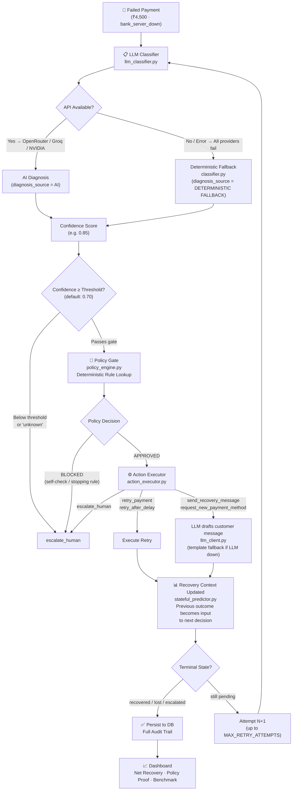
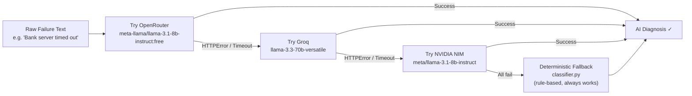

# Recovery Copilot
### Bounded, auditable AI revenue-recovery engine for failed payments & abandoned checkouts.

[](https://www.python.org/)
[](https://fastapi.tiangolo.com/)
[](LICENSE)
[](https://github.com/anushka-chand)

> **RECOVERY COPILOT** — Next-Generation AI-Driven Revenue Recovery Engine with Deterministic Policy Rails.
> Created & Maintained by **[Anushka Chand](https://github.com/anushka-chand)**

---

## Problem Statement
When online payments fail or customers abandon checkouts, businesses lose significant revenue due to static, generic, or poorly timed recovery attempts. Standard payment gateways rely on basic retr[...]

---

## How It Works

Recovery Copilot processes payments through a strict five-stage pipeline (**Diagnose → Decide → Execute → Stop → Report**):

1. **Diagnose**: Classifies why a payment failed based on the structured gateway failure code. This step is deterministic and does not use an LLM, ensuring speed and reliability.
2. **Decide**: Maps the failure diagnosis to a specific action using a strict rule-lookup table. A confidence gate checks the classification certainty; if the confidence is below the defined thres[...]
3. **Execute**: Simulates the recovery action (such as instant retry, 24-hour delayed retry, SMS nudges, or request for new payment method). If it is a nudge or payment method update, the LLM gene[...]
4. **Stop**: Enforces limits to protect user experience. A stopping rule stops retrying if the attempts exceed `MAX_RETRY_ATTEMPTS`, and a self-check blocks the system from repeating an action tha[...]
5. **Report**: Synthesizes execution data, showing gross vs. **net** recovery metrics (adjusting for action costs like SMS or human labor) and logging a complete audit trail for each transaction.

### Architecture Diagram



### Three-Provider LLM Fallback Chain



> The system **never breaks** regardless of API availability. The deterministic fallback is the final guarantee.

---

## Key Design Decisions

- **LLM is advisory, never authoritative**: The LLM classifies the failure. The **Policy Gate** (`policy_engine.py`) makes the final financial decision using deterministic rules the LLM cannot ove[...]
- **Three-provider AI cascade**: OpenRouter → Groq → NVIDIA NIM. If all fail, deterministic rules take over. Every step is logged.
- **Stateful Recovery Context**: Each failed attempt is recorded into `stateful_predictor.py`. The next attempt receives the full context — this is what separates Recovery Copilot from a simple [...]
- **Diagnosis Source transparency**: The UI explicitly labels each diagnosis as `AI` (purple) or `DETERMINISTIC FALLBACK` (amber), so evaluators can see exactly what drove the decision.
- **Confidence Gating**: Confidence below 0.70 → forced `escalate_human`. Unknown error codes default to 0.40, ensuring they always route to human review.
- **Strict Stopping Rule**: Hard cap of `MAX_RETRY_ATTEMPTS` (default: 3) per transaction. Prevents customer spam.
- **Anti-Repetition Self-Check**: If an action was already tried and failed, the Policy Gate blocks it and forces escalation.
- **RBI/TRAI Compliance Framing**: Retry limits and messaging gates are designed in accordance with RBI e-mandate retry guidelines and TRAI DND regulations.

---

## UI: Story-Driven Recovery Pipeline

The frontend (`index.html`) is a single-page "Recovery Story" — not a metrics dashboard. It tells the story of one payment failure resolved through the pipeline:

| Section | What it shows |
|---|---|
| **Failed Payment** | The transaction that triggered recovery (₹4,500 · `bank_server_down`) |
| **AI Diagnosis** | Classification result, confidence score, and source (AI or DETERMINISTIC FALLBACK) |
| **Policy Gate** | APPROVED / BLOCKED badge + the exact rules that fired |
| **Execution** | Which action was taken and what the LLM-generated message looked like |
| **Next Best Action** | What the stateful predictor recommends next (from recovery context) |
| **Attempt Timeline** | Chronological attempt history with `RECOVERY CONTEXT UPDATED` markers between attempts |
| **Technical Audit** | Expandable JSON-level detail for every field of every attempt |
| **Benchmark** | Recovery rates across 4 synthetic distribution scenarios (anti-cherry-picking proof) |

---

## Changelog

### v0.4 — Demo Integrity & Frontend Overhaul (2026-08-26)
- **Fixed critical demo inconsistency**: Removed `|| t.failure_code === 'bank_server_down'` fallback in transaction lookup that caused the UI to display a random ₹7,466 transaction instead of t[...]
- **Canonical demo transaction**: Now always identified by exact `payment_id === 'demo_pay_ref_4500'` match. If not found, UI shows seed instruction rather than silently loading wrong data.
- **RESET DEMO no longer calls `/transactions/generate`**: That endpoint appended 60 random rows on every click, which polluted the DB and shadowed the canonical demo transaction. Reset now just [...]
- **Diagnosis Source labels**: Badge now explicitly shows `AI` (purple) or `DETERMINISTIC FALLBACK` (amber) — never the internal string `"Deterministic Rules"`.
- **Diagnosis card expanded**: Added `Source` as a separate labeled field alongside `Diagnosis` and `Confidence` in a 3-column grid.
- **Recovery-in-progress copy fixed**: Replaced "Waiting for next execution step or human escalation path" with clear "Attempt N complete. Outcome recorded as context for next decision."
- **LLM model names fixed**: `OPENROUTER_MODEL` corrected from invalid `openrouter/free` to `meta-llama/llama-3.1-8b-instruct:free`; `GROQ_MODEL` updated from deprecated `llama-3.1-8b-instant` to[...]
- **Per-provider timeout**: Reduced from 10s → 6s so the 3-provider cascade completes faster.
- **Error logging improvement**: LLM classifier now logs HTTP status code alongside exception type for faster debugging.

### v0.3 — Stateful Predictor & Audit Trail (2026-08-25)
- Added `stateful_predictor.py` — recovery context carries forward between attempts.
- Added `diagnosis_source` field to `RecoveryAttempt` model and audit trail schema.
- Multi-provider LLM fallback chain (OpenRouter → Groq → NVIDIA NIM → deterministic).
- Added `action_executor.py`, `policy_engine.py`, `recovery_context.py`, `recovery_value.py` services.
- Added full audit trail API: `GET /recovery/audit/{transaction_id}`.
- Added `GET /recovery/outcome-dataset` CSV export endpoint.

### v0.2 — Frontend Redesign (2026-08-25)
- Rewrote `index.html` from a metrics dashboard into a story-driven recovery pipeline UI.
- Added `Operations` dropdown to hide batch controls, scenario switcher, and CSV export during presentations.
- Added interactive attempt timeline with `RECOVERY CONTEXT UPDATED` transition markers.
- Added expandable Technical Audit drawer.
- Added Benchmark section with multi-scenario recovery rate comparison.

### v0.1 — Core Engine (2026-08-24)
- Initial FastAPI backend with `engine.py`, `classifier.py`, `decision_router.py`, `llm_client.py`.
- SQLite persistence with `Transaction` and `RecoveryAttempt` models.
- Synthetic data generator with 4 scenario mixes.
- Replay harness for anti-cherry-picking proof.
- Seed script for canonical demo transaction.

---

## Demo Setup

> Run this once before any demo or recording:

```bash
python scripts/seed_demo.py
```

This creates a fresh `demo_pay_ref_4500` transaction (₹4,500 · `bank_server_down`) with zero prior attempts. The UI will then tell the complete recovery story from scratch when you click **RUN[...]

To fully reset between demo runs (clear all prior attempts):
```bash
python scripts/seed_demo.py  # idempotent — deletes and re-creates the demo transaction
uvicorn app.main:app --reload
```

---

## API Reference

### Transactions (`/transactions`)

| Method | Endpoint | Description |
|---|---|---|
| `POST` | `/transactions/generate` | Generate synthetic failed transactions |
| `GET` | `/transactions` | List all transactions |

### Recovery (`/recovery`)

| Method | Endpoint | Description |
|---|---|---|
| `POST` | `/recovery/run/{id}` | Run one recovery step on a transaction |
| `POST` | `/recovery/run-batch` | Run one pass over all open transactions |
| `POST` | `/recovery/run-until-resolved` | Loop until all transactions reach terminal state |
| `GET` | `/recovery/audit/{id}` | Full audit trail for one transaction |
| `GET` | `/recovery/outcome-dataset` | Export outcomes as CSV |
| `GET` | `/recovery/settings` | Get current diagnosis mode and threshold |
| `POST` | `/recovery/settings` | Update diagnosis mode and threshold |

### Dashboard (`/dashboard`)

| Method | Endpoint | Description |
|---|---|---|
| `GET` | `/dashboard/summary` | Aggregated recovery metrics |
| `GET` | `/health` | Liveness probe |
| `GET` | `/` | Serves `index.html` SPA |

---

## Setup & Run

```bash
# 1. Clone and enter
cd recovery-bot

# 2. Create virtualenv
python -m venv venv
.\venv\Scripts\Activate.ps1   # Windows
source venv/bin/activate      # macOS/Linux

# 3. Install dependencies
pip install -r requirements.txt

# 4. Configure environment
cp .env.example .env
# Edit .env — add your OPENROUTER_API_KEY (free at openrouter.ai/keys)

# 5. Seed demo transaction
python scripts/seed_demo.py

# 6. Start server
uvicorn app.main:app --reload

# Open http://127.0.0.1:8000/
```

### Environment Variables

| Variable | Default | Description |
|---|---|---|
| `OPENROUTER_API_KEY` | — | Free key from openrouter.ai |
| `OPENROUTER_MODEL` | `meta-llama/llama-3.1-8b-instruct:free` | Primary AI model |
| `GROQ_API_KEY` | — | Groq fallback key |
| `GROQ_MODEL` | `llama-3.3-70b-versatile` | Groq fallback model |
| `NVIDIA_API_KEY` | — | NVIDIA NIM fallback key |
| `DATABASE_URL` | `sqlite:///./recovery.db` | Database connection |
| `MAX_RETRY_ATTEMPTS` | `3` | Hard cap per transaction |
| `CONFIDENCE_THRESHOLD` | `0.70` | Below this → escalate human |
| `DIAGNOSIS_MODE` | `llm` | `"llm"` or `"deterministic"` |

---

## Project Structure

```
recovery-bot/
├── app/
│   ├── core/
│   │   ├── config.py              # Settings, action costs, env config
│   │   └── database.py            # SQLAlchemy engine and session
│   ├── models/
│   │   ├── models.py              # Transaction & RecoveryAttempt DB models
│   │   └── schemas.py             # Pydantic validation schemas
│   ├── routers/
│   │   ├── dashboard.py           # Aggregated stats endpoints
│   │   ├── recovery.py            # Recovery cycle & audit endpoints
│   │   ├── transactions.py        # Batch generation endpoints
│   │   └── invoices.py            # Invoice recovery endpoints
│   ├── services/
│   │   ├── action_executor.py     # Executes approved recovery actions
│   │   │   ├── classifier.py          # Deterministic failure classification
│   │   │   ├── dashboard.py           # Metric aggregation logic
│   │   │   ├── data_generator.py      # Synthetic transaction generation
│   │   │   ├── decision_router.py     # Bounded rules table & confidence gate
│   │   │   ├── engine.py              # Transaction lifecycle orchestration
│   │   │   ├── llm_classifier.py      # Multi-provider AI classification cascade
│   │   │   ├── llm_client.py          # LLM message drafting (3-provider cascade)
│   │   │   ├── policy_engine.py       # Deterministic policy gate (LLM cannot bypass)
│   │   │   ├── recovery_context.py    # Context object passed between attempts
│   │   │   ├── recovery_value.py      # Net recovery value calculations
│   │   │   └── stateful_predictor.py  # Stateful context propagation between attempts
│   └── main.py                    # FastAPI entrypoint, CORS, SPA serving
├── scripts/
│   ├── replay_harness.py          # Multi-scenario stress test (anti-cherry-picking)
│   └── seed_demo.py               # Canonical demo transaction seeder
├── tests/
│   ├── test_audit.py              # Audit trail correctness tests
│   │   └── test_concurrency.py        # Concurrent recovery stress tests
├── docs/
│   └── final_benchmark_sanity.md  # Benchmark methodology and sanity checks
├── .env                           # Environment configuration (not committed)
├── .env.example                   # Template
├── index.html                     # Story-driven SPA frontend
├── requirements.txt               # Python dependencies
└── recovery.db                    # SQLite DB (auto-created)
```

---

## Replay Harness — Anti-Cherry-Picking Proof

```bash
python scripts/replay_harness.py
```

Runs recovery cycles across 4 distinct failure distributions to prove the engine isn't overfit to a single dataset:

| Scenario | Description | Expected Behaviour |
|---|---|---|
| `baseline` | Normal distribution | ~35–45% recovery rate |
| `card_heavy` | High expired card / invalid CVV | Lower recovery (customer-side failures) |
| `infra_heavy` | High bank_server_down / network_timeout | Higher recovery (infra failures resolve on retry) |
| `ambiguous_heavy` | High generic declines | More escalations (low confidence → human review) |

---

## Roadmap (Intentionally Deferred)

1. **Real payment gateway execution**: Deferred to avoid introducing real financial side effects in simulation mode. The current execution adapter uses deterministic simulation while preserving the standard schema.

2. **Real SMS/Email delivery**: Deferred to avoid Twilio/SendGrid external API rate-limit dependencies. LLM-generated recovery messages are generated and recorded in the audit trail to demonstrate the complete pipeline.

3. **Natural-language dashboard queries**: Deferred — text-to-SQL introduces prompt-injection and data-access risks. Deterministic aggregations and existing API endpoints are preferred for the [...]

4. **Automated cron reporting**: Deferred — requires Celery + broker infrastructure and persistent scheduling. The current API exposes recovery summaries and outcome datasets synchronously.

5. **Online model retraining**: Deferred — continuously retraining recovery models from live outcomes requires a validated production dataset and model evaluation pipeline. The current system r[...]

6. **Adaptive policy learning**: Deferred — automatically modifying financial safety thresholds based on observed outcomes would require policy versioning, simulation, approval workflows, and r[...]

7. **Human-in-the-loop operations console**: Deferred — the current system supports `escalate_human` as a controlled execution outcome, while a dedicated review queue, approval workflow, and SL[...]

8. **Production-scale distributed workers**: Deferred — the current implementation uses thread-based parallel processing for independent transactions. Distributed queues, workers, Redis/Kafka, [...]

9. **Advanced customer-level personalization**: Deferred — customer recovery profiles require longitudinal payment history and additional privacy/data-governance controls. Current decisioning o[...]

10. **Live provider optimization**: Deferred — dynamic routing between OpenRouter, NVIDIA NIM, Groq, and local models based on latency, cost, and quality requires production telemetry. The curr[...]

11. **Real-time anomaly detection**: Deferred — detecting unusual recovery rates, provider failures, or policy violations requires continuous monitoring and alerting infrastructure. Current ben[...]

12. **Full compliance and governance layer**: Deferred — immutable audit storage, model/version provenance, policy versioning, retention controls, and formal compliance reporting are production[...]
